<div align="center">

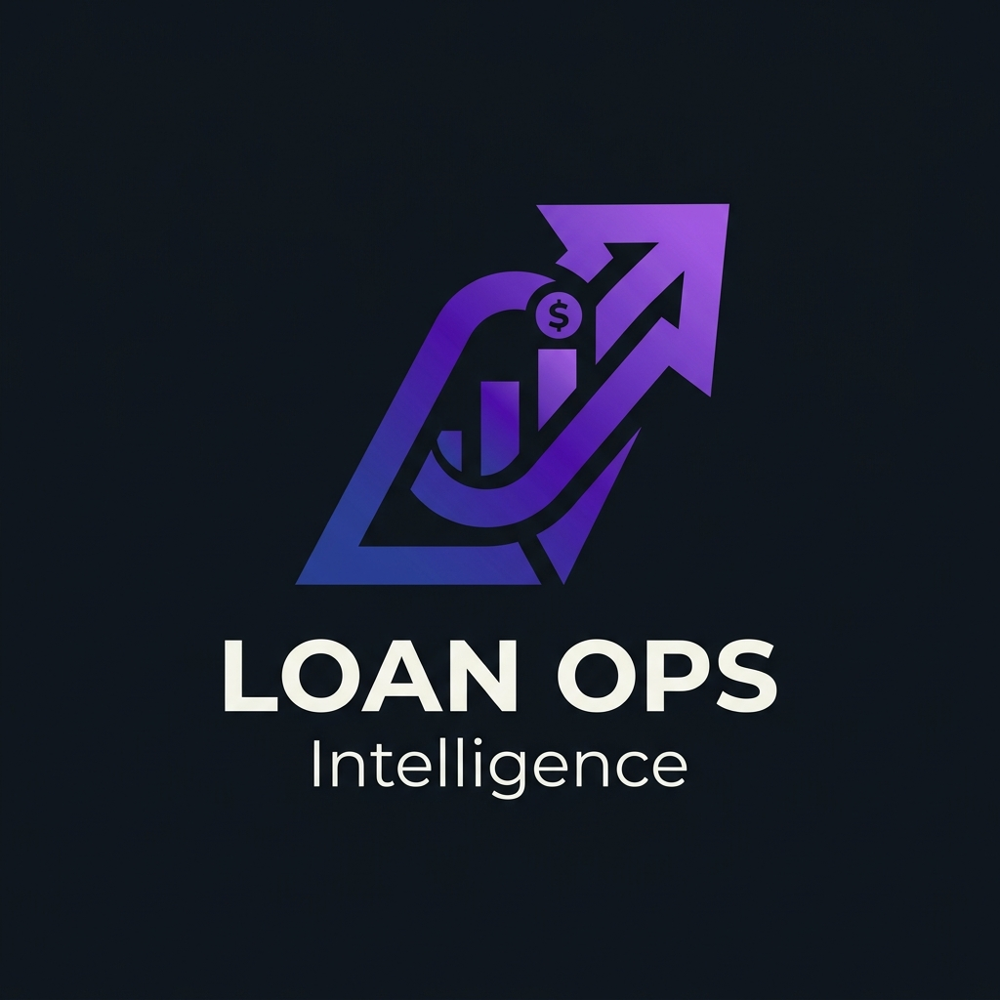

<br/>

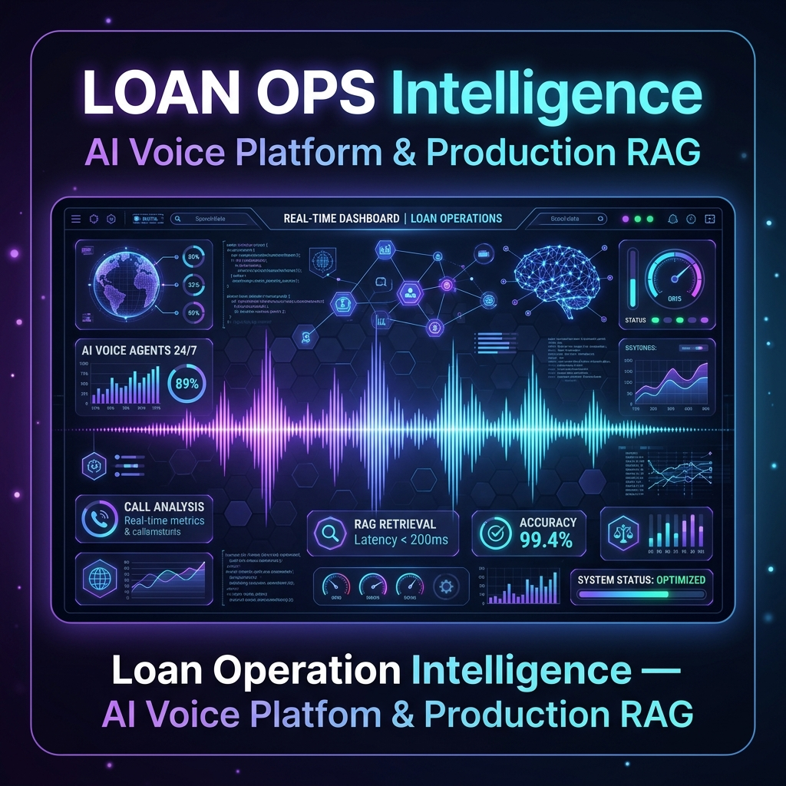

<br/><br/>

# 🏦 Loan Operation Intelligence

### AI Voice Platform · Production RAG · Real-Time Operations Infrastructure

*A knowledge-grounded voice agent for loan servicing — where every spoken answer is retrieved, cited, and auditable, and every call generates live operational intelligence instead of a next-day report.*

<br/>

[](https://www.python.org/)
[](https://fastapi.tiangolo.com/)
[](https://nextjs.org/)
[](https://www.typescriptlang.org/)
[](https://www.postgresql.org/)
[](https://redis.io/)
[](https://www.pinecone.io/)
[](https://openai.com/)
[](https://vapi.ai/)
[](https://langfuse.com/)
[](#-license)

<br/>

[Live Demo](#) · [Video Walkthrough](#) · [Architecture PDF](#) · [API Docs](#-api-documentation) · [System Design](#-system-design)

</div>

---

## 📌 At a Glance

<div align="center">


</div>

| Metric | Value |
| --- | --- |
| REST API surface | 30+ endpoints across voice, knowledge, calls, nudges, and evaluation |
| Orchestration graphs | 2 LangGraph state machines (Conversation Tracker, Nudge Pipeline) |
| Retrieval sources | PostgreSQL (system of record) + Pinecone (semantic index) |
| Real-time channels | Redis pub/sub → Server-Sent Events → dashboard |
| Observability | Langfuse tracing on every RAG query, tool call, and nudge generation |
| Test suite | Pytest + pytest-asyncio, PostgreSQL-backed, isolated test database |

---

## 📖 Overview

**Loan Operation Intelligence** is a production-shaped AI voice platform for one of fintech's least glamorous, highest-stakes workflows: loan pre-due reminders. Every call blends a regulated conversation (identity verification, mandated disclosures, fair-practice language) with genuine ambiguity (borrowers ask real questions, raise real objections, and expect real answers) — which makes it a poor fit for either a rigid IVR tree or an ungrounded chatbot.

This platform resolves that tension with a knowledge-grounded voice agent: a Vapi-powered conversational layer backed by a PostgreSQL + Pinecone retrieval system, so every policy or product answer traces back to a cited source instead of the model's imagination. A declarative rule engine and compliance monitor sit alongside the conversation, enforcing escalation and disclosure requirements independently of whatever the LLM decides to say. A real-time nudge pipeline listens to the call as it happens and surfaces actionable coaching — missed cross-sell opportunities, compliance gaps, rising frustration — before the call ends, not in a report the next morning.

The result is a system designed the way a fintech engineering team would actually build it: grounded answers over confident guesses, measurable retrieval quality over vibes, and safe failure modes (explicit "I don't know, let me connect you with a team member") over silent hallucination.

---

## 🏛️ Architecture Overview

Loan Operation Intelligence is built around a single non-negotiable principle: **the voice agent never asserts a fact it cannot source.** Every architectural decision below — the tool layer sitting between the LLM and the database, the separate retrieval path for policy knowledge, the independent compliance monitor — exists to enforce that principle at the system level rather than relying on prompting alone.

### 🔭 System Architecture

<div align="center">
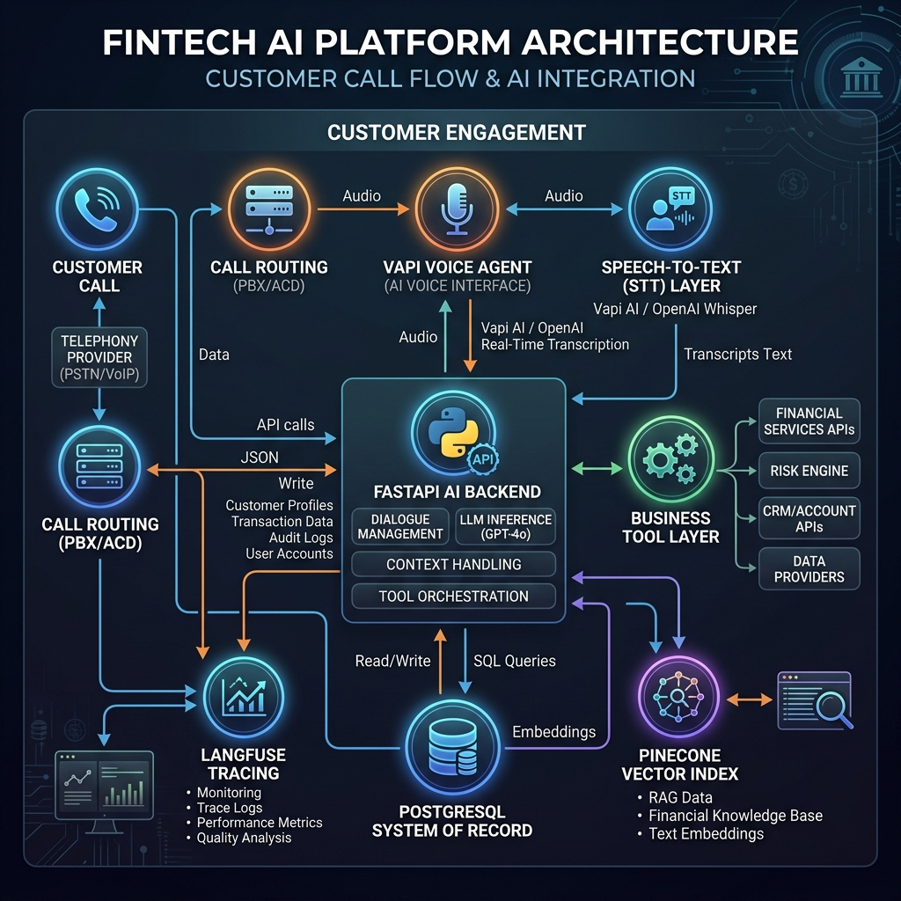
</div>

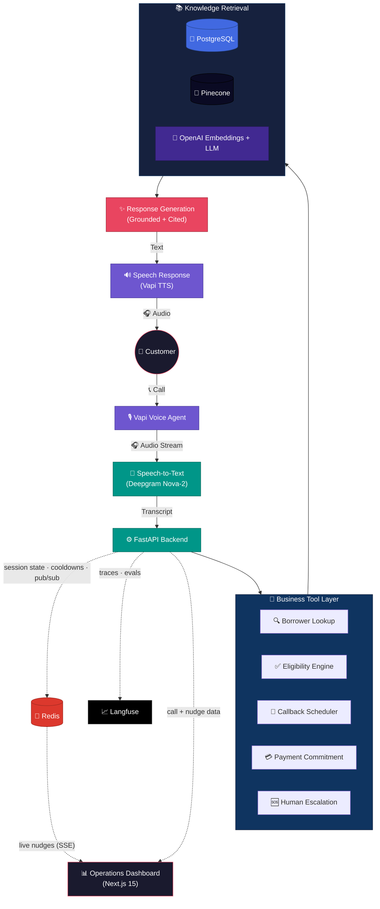
```mermaid
flowchart TB
    Customer(("👤 Customer"))

    Customer -->|"📞 Call"| Vapi["🎙️ Vapi Voice Agent"]
    Vapi -->|"🎧 Audio Stream"| STT["📝 Speech-to-Text<br/>(Deepgram Nova-2)"]
    STT -->|"Transcript"| API["⚙️ FastAPI Backend"]

    API --> Tools

    subgraph Tools["🧰 Business Tool Layer"]
        direction LR
        T1["🔍 Borrower Lookup"]
        T2["✅ Eligibility Engine"]
        T3["📅 Callback Scheduler"]
        T4["💳 Payment Commitment"]
        T5["🆘 Human Escalation"]
    end

    Tools --> Retrieval

    subgraph Retrieval["📚 Knowledge Retrieval"]
        direction LR
        PG[("🐘 PostgreSQL")]
        PC[("🌲 Pinecone")]
        OAI["🧠 OpenAI Embeddings + LLM"]
    end

    Retrieval --> Gen["✨ Response Generation<br/>(Grounded + Cited)"]
    Gen -->|"Text"| TTS["🔊 Speech Response<br/>(Vapi TTS)"]
    TTS -->|"🎧 Audio"| Customer

    API -.->|"session state · cooldowns · pub/sub"| Redis[("🔴 Redis")]
    API -.->|"traces · evals"| Langfuse["📈 Langfuse"]
    Redis -.->|"live nudges (SSE)"| Dashboard["📊 Operations Dashboard<br/>(Next.js 15)"]
    API -.->|"call + nudge data"| Dashboard

    style Customer fill:#1a1a2e,stroke:#e94560,color:#fff
    style Vapi fill:#6E56CF,stroke:#4a3a99,color:#fff
    style API fill:#009688,stroke:#00695c,color:#fff
    style Tools fill:#0f3460,stroke:#16213e,color:#fff
    style Retrieval fill:#16213e,stroke:#0f3460,color:#fff
    style PG fill:#4169E1,stroke:#274690,color:#fff
    style PC fill:#0A0A23,stroke:#000,color:#fff
    style OAI fill:#412991,stroke:#2a1a5e,color:#fff
    style Redis fill:#DC382D,stroke:#a12920,color:#fff
    style Langfuse fill:#000,stroke:#333,color:#fff
    style Dashboard fill:#1a1a2e,stroke:#e94560,color:#fff
    style Gen fill:#e94560,stroke:#a12938,color:#fff
    style TTS fill:#6E56CF,stroke:#4a3a99,color:#fff
    style STT fill:#009688,stroke:#00695c,color:#fff
```

### 🎙️ Voice Pipeline

End-to-end path a single utterance travels through, from raw audio to a compliant, spoken answer:


```mermaid
flowchart LR
    Customer(("👤 Customer")) --> Vapi["🎙️ Vapi"]
    Vapi --> ASR["📝 ASR<br/>(Deepgram Nova-2)"]
    ASR --> Tracker["🧭 Conversation Tracker<br/>(LangGraph)"]
    Tracker --> Tools["🧰 Business Tools"]
    Tools --> RAG["🔍 RAG"]
    RAG --> Compliance["🛡️ Compliance Engine"]
    Compliance --> GPT["🧠 GPT-4o"]
    GPT --> TTS["🔊 TTS"]
    TTS --> Customer

    style Customer fill:#1a1a2e,stroke:#e94560,color:#fff
    style Vapi fill:#6E56CF,stroke:#4a3a99,color:#fff
    style ASR fill:#009688,stroke:#00695c,color:#fff
    style Tracker fill:#0f3460,stroke:#16213e,color:#fff
    style Tools fill:#16213e,stroke:#0f3460,color:#fff
    style RAG fill:#0A0A23,stroke:#000,color:#fff
    style Compliance fill:#8B0000,stroke:#4d0000,color:#fff
    style GPT fill:#412991,stroke:#2a1a5e,color:#fff
    style TTS fill:#6E56CF,stroke:#4a3a99,color:#fff
```

The **Compliance Engine sits after RAG and before generation, not after** — required disclosures and prohibited-language checks are evaluated against the *proposed* response, so a non-compliant answer is caught before it's ever spoken, not flagged retroactively.

### 🔎 RAG Pipeline

How raw source content becomes a citable, retrievable answer:

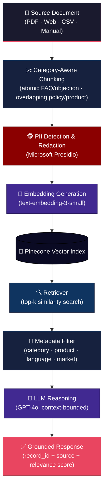
```mermaid
flowchart TB
    Source["📄 Source Document<br/>(PDF · Web · CSV · Manual)"] --> Chunk["✂️ Category-Aware Chunking<br/>(atomic FAQ/objection · overlapping policy/product)"]
    Chunk --> PII["🕵️ PII Detection & Redaction<br/>(Microsoft Presidio)"]
    PII --> Embed["🧬 Embedding Generation<br/>(text-embedding-3-small)"]
    Embed --> Pinecone[("🌲 Pinecone Vector Index")]
    Pinecone --> Retriever["🔍 Retriever<br/>(top-k similarity search)"]
    Retriever --> Filter["🧮 Metadata Filter<br/>(category · product · language · market)"]
    Filter --> LLM["🧠 LLM Reasoning<br/>(GPT-4o, context-bounded)"]
    LLM --> Grounded["✅ Grounded Response<br/>(record_id + source + relevance score)"]

    style Source fill:#1a1a2e,stroke:#e94560,color:#fff
    style Chunk fill:#16213e,stroke:#0f3460,color:#fff
    style PII fill:#8B0000,stroke:#4d0000,color:#fff
    style Embed fill:#412991,stroke:#2a1a5e,color:#fff
    style Pinecone fill:#0A0A23,stroke:#000,color:#fff
    style Retriever fill:#0f3460,stroke:#16213e,color:#fff
    style Filter fill:#16213e,stroke:#0f3460,color:#fff
    style LLM fill:#412991,stroke:#2a1a5e,color:#fff
    style Grounded fill:#e94560,stroke:#a12938,color:#fff
```

### 🔁 Voice Interaction Sequence

A concrete walkthrough: a borrower asks *"What's my outstanding balance and can I get an extension?"*

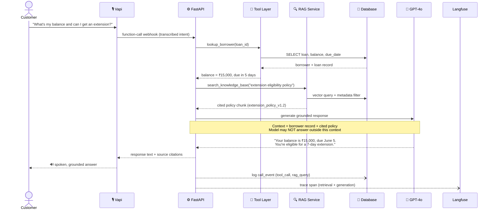
```mermaid
sequenceDiagram
    actor Customer
    participant Vapi as 🎙️ Vapi
    participant API as ⚙️ FastAPI
    participant Tools as 🧰 Tool Layer
    participant RAG as 🔍 RAG Service
    participant DB as 🐘 Database
    participant LLM as 🧠 GPT-4o

    Customer->>Vapi: "What's my balance and can I get an extension?"
    Vapi->>API: function-call webhook (transcribed intent)
    API->>Tools: lookup_borrower(loan_id)
    Tools->>DB: SELECT loan, balance, due_date
    DB-->>Tools: borrower + loan record
    Tools-->>API: balance = ₹15,000, due in 5 days

    API->>RAG: search_knowledge_base("extension eligibility policy")
    RAG->>DB: vector query + metadata filter
    RAG-->>API: cited policy chunk (extension_policy_v1.2)

    API->>LLM: generate grounded response
    Note over API,LLM: Context = borrower record + cited policy<br/>Model may NOT answer outside this context
    LLM-->>API: "Your balance is ₹15,000, due June 5.<br/>You're eligible for a 7-day extension."

    API-->>Vapi: response text + source citations
    Vapi-->>Customer: 🔊 spoken, grounded answer

    API--)DB: log call_event (tool_call, rag_query)
    API--)Langfuse: trace span (retrieval + generation)
```

### 📚 Knowledge Retrieval Sequence

How a raw question becomes a scored, cited retrieval result:

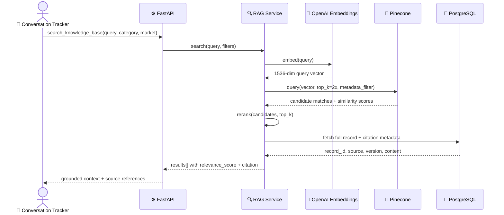
```mermaid
sequenceDiagram
    actor Agent as 🧭 Conversation Tracker
    participant API as ⚙️ FastAPI
    participant RAG as 🔍 RAG Service
    participant OAI as 🧠 OpenAI Embeddings
    participant PC as 🌲 Pinecone
    participant PG as 🐘 PostgreSQL

    Agent->>API: search_knowledge_base(query, category, market)
    API->>RAG: search(query, filters)
    RAG->>OAI: embed(query)
    OAI-->>RAG: 1536-dim query vector

    RAG->>PC: query(vector, top_k=2x, metadata_filter)
    PC-->>RAG: candidate matches + similarity scores

    RAG->>RAG: rerank(candidates, top_k)
    RAG->>PG: fetch full record + citation metadata
    PG-->>RAG: record_id, source, version, content

    RAG-->>API: results[] with relevance_score + citation
    API-->>Agent: grounded context + source references
```

### 📅 Callback Scheduling Sequence

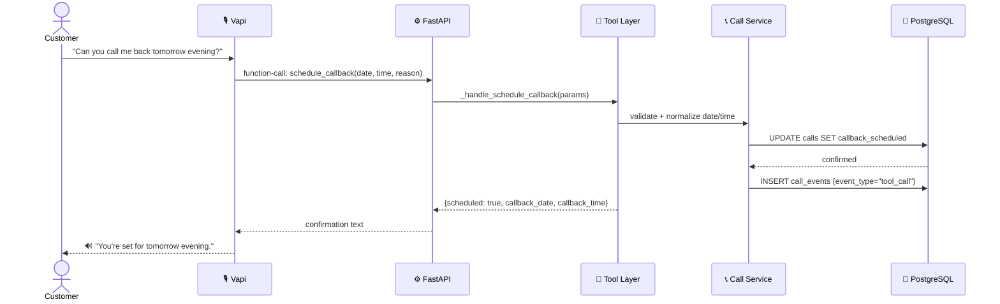
```mermaid
sequenceDiagram
    actor Customer
    participant Vapi as 🎙️ Vapi
    participant API as ⚙️ FastAPI
    participant Tools as 🧰 Tool Layer
    participant CallSvc as 📞 Call Service
    participant PG as 🐘 PostgreSQL

    Customer->>Vapi: "Can you call me back tomorrow evening?"
    Vapi->>API: function-call: schedule_callback(date, time, reason)
    API->>Tools: _handle_schedule_callback(params)
    Tools->>CallSvc: validate + normalize date/time
    CallSvc->>PG: UPDATE calls SET callback_scheduled
    PG-->>CallSvc: confirmed
    CallSvc->>PG: INSERT call_events (event_type="tool_call")
    Tools-->>API: {scheduled: true, callback_date, callback_time}
    API-->>Vapi: confirmation text
    Vapi-->>Customer: 🔊 "You're set for tomorrow evening."
```

### 🆘 Human Escalation Sequence

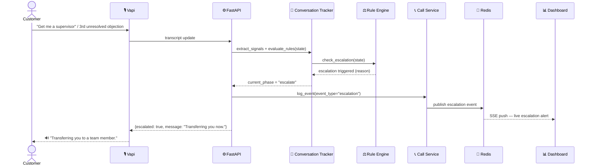
```mermaid
sequenceDiagram
    actor Customer
    participant Vapi as 🎙️ Vapi
    participant API as ⚙️ FastAPI
    participant Tracker as 🧭 Conversation Tracker
    participant Rules as ⚖️ Rule Engine
    participant CallSvc as 📞 Call Service
    participant Redis as 🔴 Redis
    participant Dash as 📊 Dashboard

    Customer->>Vapi: "Get me a supervisor" / 3rd unresolved objection
    Vapi->>API: transcript update
    API->>Tracker: extract_signals + evaluate_rules(state)
    Tracker->>Rules: check_escalation(state)
    Rules-->>Tracker: escalation triggered (reason)
    Tracker-->>API: current_phase = "escalate"

    API->>CallSvc: log_event(event_type="escalation")
    CallSvc->>Redis: publish escalation event
    Redis-->>Dash: SSE push — live escalation alert
    API-->>Vapi: {escalated: true, message: "Transferring you now."}
    Vapi-->>Customer: 🔊 "Transferring you to a team member."
```

### 🧩 System Components

| Component | Technology | Responsibilities |
| --- | --- | --- |
| **Frontend** | Next.js 15 + TypeScript | Real-time operations dashboard; renders live call state, nudges (via SSE), transcripts, and analytics |
| **FastAPI Backend** | FastAPI (async) | Webhook orchestration, tool-call routing, request validation, lifecycle management for all downstream clients |
| **PostgreSQL** | PostgreSQL 16 + SQLAlchemy (async) | System of record for calls, borrowers, business rules, KB records, nudges, and the full event-sourced audit trail |
| **Redis** | Redis 7 | Session state, nudge pub/sub delivery, cooldown/dedup control, idempotency, KB query caching |
| **Pinecone** | Managed vector DB | Semantic search index over chunked, embedded knowledge-base content with metadata filtering |
| **OpenAI** | GPT-4o / GPT-4o-mini / text-embedding-3-small | Embedding generation, grounded response reasoning, signal extraction, nudge text generation |
| **Vapi** | Voice AI platform | Telephony, streaming ASR/TTS orchestration, turn-taking, and tool-call dispatch to FastAPI |
| **Langfuse** | LLM observability platform | End-to-end tracing of RAG queries, tool calls, and nudge generation; evaluation scoring |

### 🌊 Data Flow

```text
🎙️  Voice Input
     │
     ▼
📝  Speech Recognition           (Vapi ASR → transcript)
     │
     ▼
🧰  Business Tool Execution      (borrower lookup · eligibility · callback · commitment · escalation)
     │
     ▼
📚  Knowledge Retrieval           (Pinecone vector search → PostgreSQL metadata → cited chunks)
     │
     ▼
🧠  Grounded LLM Reasoning        (GPT-4o reasons ONLY over retrieved + tool context)
     │
     ▼
🔊  Voice Response                (Vapi TTS → spoken, cited answer)
     │
     ▼
📈  Observability                 (Langfuse trace: latency, tokens, retrieval quality)
     │
     ▼
📊  Dashboard Updates             (Redis pub/sub → SSE → live operations view)
```

Every stage writes a structured event to PostgreSQL's `call_events` table — the pipeline above is not just a runtime flow, it's a replayable audit trail.

### 🗂️ Data Model

Logical domain model underlying the platform:

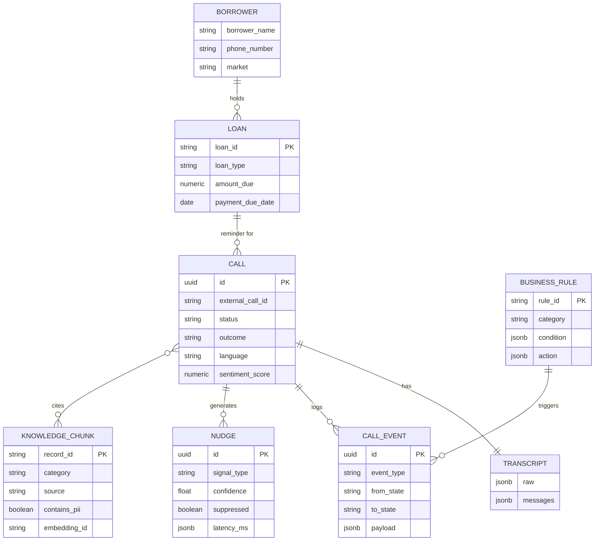
```mermaid
erDiagram
    BORROWER ||--o{ LOAN : holds
    LOAN ||--o{ CALL : "reminder for"
    CALL ||--|| TRANSCRIPT : has
    CALL ||--o{ CALL_EVENT : logs
    CALL ||--o{ NUDGE : generates
    CALL }o--o{ KNOWLEDGE_CHUNK : cites
    BUSINESS_RULE ||--o{ CALL_EVENT : triggers

    BORROWER {
        string borrower_name
        string phone_number
        string market
    }
    LOAN {
        string loan_id PK
        string loan_type
        numeric amount_due
        date payment_due_date
    }
    CALL {
        uuid id PK
        string external_call_id
        string status
        string outcome
        string language
        numeric sentiment_score
    }
    TRANSCRIPT {
        jsonb raw
        jsonb messages
    }
    CALL_EVENT {
        uuid id PK
        string event_type
        string from_state
        string to_state
        jsonb payload
    }
    NUDGE {
        uuid id PK
        string signal_type
        float confidence
        boolean suppressed
        jsonb latency_ms
    }
    KNOWLEDGE_CHUNK {
        string record_id PK
        string category
        string source
        boolean contains_pii
        string embedding_id
    }
    BUSINESS_RULE {
        string rule_id PK
        string category
        jsonb condition
        jsonb action
    }
```

> **Physical vs. logical schema:** `BORROWER` and `LOAN` are shown here as first-class entities for clarity of the domain model. The current physical schema denormalizes them directly onto `calls` (`borrower_name`, `loan_id`, `loan_type`, `amount_due`) since a single call is always scoped to one borrower/loan pair — this avoids a join on the hottest read path at current scale. `TRANSCRIPT` is likewise stored as a `JSONB` column on `calls.transcript` rather than a separate table. `KNOWLEDGE_CHUNK` corresponds to `kb_records`. See `backend/app/models/` for the authoritative physical schema.

### ☁️ Deployment Architecture

<div align="center">
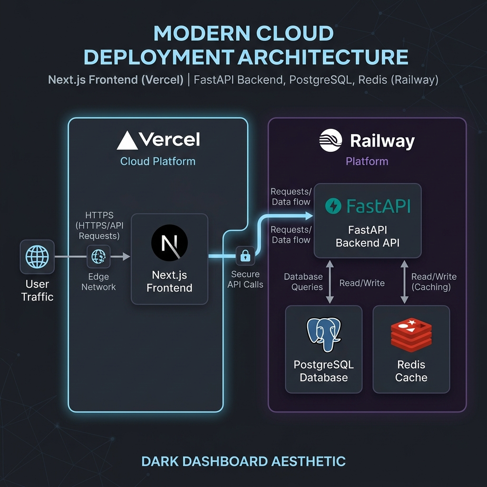
</div>

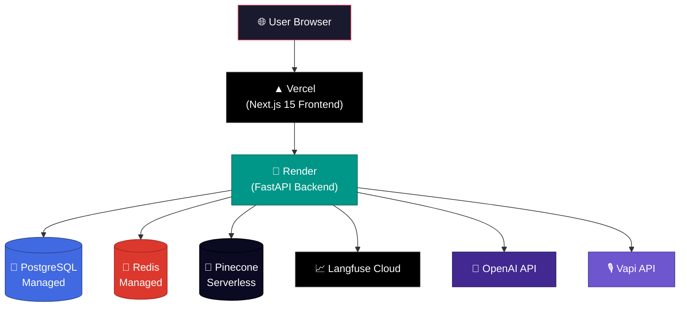
```mermaid
flowchart TB
    Browser["🌐 User Browser"]

    Browser --> Vercel["▲ Vercel<br/>(Next.js 15 Frontend)"]
    Vercel --> Render["🚀 Render<br/>(FastAPI Backend)"]

    Render --> PG[("🐘 PostgreSQL<br/>Managed")]
    Render --> Redis[("🔴 Redis<br/>Managed")]
    Render --> Pinecone[("🌲 Pinecone<br/>Serverless")]
    Render --> Langfuse["📈 Langfuse Cloud"]
    Render --> OpenAI["🧠 OpenAI API"]
    Render --> Vapi["🎙️ Vapi API"]

    style Browser fill:#1a1a2e,stroke:#e94560,color:#fff
    style Vercel fill:#000,stroke:#333,color:#fff
    style Render fill:#009688,stroke:#00695c,color:#fff
    style PG fill:#4169E1,stroke:#274690,color:#fff
    style Redis fill:#DC382D,stroke:#a12920,color:#fff
    style Pinecone fill:#0A0A23,stroke:#000,color:#fff
    style Langfuse fill:#000,stroke:#333,color:#fff
    style OpenAI fill:#412991,stroke:#2a1a5e,color:#fff
    style Vapi fill:#6E56CF,stroke:#4a3a99,color:#fff
```

| Layer | Platform | Notes |
| --- | --- | --- |
| Frontend | Vercel | Edge-deployed Next.js 15 dashboard, SSE-connected to the backend |
| Backend | Render | Containerized FastAPI service, autoscaled behind a load balancer |
| Database | Managed PostgreSQL | Automated backups, connection pooling via `asyncpg` |
| Cache / Pub-Sub | Managed Redis | Sub-millisecond nudge delivery, session and cooldown state |
| Vector Search | Pinecone Serverless | Scales independently of the application tier |
| Observability | Langfuse Cloud | Centralized tracing across environments |

---

## 🧠 System Design

Design rationale for the decisions that shape this system — written the way an engineering team would document them before building, not retrofitted afterward.

### Why RAG instead of fine-tuning

Loan policy, product terms, and disclosure language change frequently and must be traceable to a specific version at the moment a statement was made. Fine-tuning bakes knowledge into weights that are opaque, expensive to update, and impossible to cite. RAG keeps knowledge in an inspectable, versioned store (`kb_records.version`) and lets every generated statement point back to the exact record that justified it. When policy changes, updating a KB record and re-embedding is a data operation, not a training run.

### Why tool calling instead of pure prompting

A prompt can *describe* a borrower's balance; a tool call *retrieves* it. Pure prompting has no mechanism to guarantee the number spoken matches the number in the database — the model could paraphrase, round, or hallucinate under load. Structuring `lookup_borrower`, `check_eligibility`, `schedule_callback`, `record_payment_commitment`, and `escalate_to_human` as discrete tool calls means every borrower-facing fact is the literal return value of a database query, and every action (a scheduled callback, a logged commitment) is a real write, not an LLM's claim that it happened.

### Why PostgreSQL + Pinecone (not one or the other)

These two stores solve different problems and neither substitutes for the other. PostgreSQL is the system of record: transactional, strongly consistent, relationally queryable, and where the audit trail (`call_events`) must never lose a write. Pinecone is a specialized index optimized for one operation — approximate nearest-neighbor search over embeddings — at latency and scale PostgreSQL's `pgvector` extension is not tuned for at this access pattern. Splitting them means each store does the one thing it's actually good at, with `kb_records.embedding_id` as the join key between them.

### Why Redis

Three independent needs converge on Redis rather than three different tools: **pub/sub** for pushing nudges to the dashboard in real time without polling, **ephemeral state** for cooldown/dedup windows and session tracking that don't belong in a durable relational table, and **caching** for repeated KB queries. All three are latency-critical and none require durability beyond the life of a call — exactly Redis's design center.

### Why Langfuse

An LLM-backed voice agent fails in ways that don't show up as exceptions: a retrieval that's technically successful but irrelevant, a response that's fluent but ungrounded, a tool call that's slow enough to create dead air on a live call. Langfuse traces every RAG query, tool call, and nudge generation as a span with latency, token usage, and evaluation scores attached — turning "the agent felt off on that call" into a specific span with a specific retrieval score.

### Why deterministic business rules alongside the LLM

Escalation and compliance requirements in a regulated call cannot depend on a language model's judgment being consistent turn to turn. The `RuleEngine` evaluates declarative, database-stored conditions (`{"field": "objection_count", "operator": "gte", "value": 3}`) that produce the same output for the same input every time — auditable, testable, and independent of model drift, prompt changes, or provider outages.

### Why audit trails and event sourcing

`call_events` records every state transition, tool call, RAG query, and escalation as an immutable, timestamped row rather than overwriting a single "current state" field. This makes a call fully replayable after the fact — for compliance review, for debugging a bad interaction, or for reconstructing exactly which knowledge-base version justified a specific answer six months later.

### Why grounded responses are the load-bearing constraint

Every design choice above — tool calling, RAG over fine-tuning, the compliance engine positioned after retrieval but before generation — exists in service of one property: the agent's output space is *constrained* to what it can source, rather than *hoped* to stay factual through prompting alone. That constraint is what makes an LLM-backed voice agent viable in a regulated financial workflow at all.

---

## ✨ Hero Features

<table>
<tr>
<td width="33%">

### 🎙️ AI Voice Agent
Vapi-orchestrated conversational flows with qualification logic, objection handling, and grounded fallback — never invents an answer it can't source.

</td>
<td width="33%">

### 📚 Knowledge-Grounded RAG
PostgreSQL + Pinecone retrieval pipeline with PII-aware ingestion, category-aware chunking, metadata filtering, and per-answer citations.

</td>
<td width="33%">

### ⚡ Real-Time Nudge Engine
Streaming signal detection surfaces compliance gaps, sentiment shifts, and missed opportunities mid-call, with confidence thresholds and duplicate/cooldown suppression.

</td>
</tr>
<tr>
<td width="33%">

### 🧑‍💼 Borrower & Loan Tools
Borrower lookup, eligibility checks, callback scheduling, and payment-commitment logging exposed as first-class voice-agent tool calls.

</td>
<td width="33%">

### 🛡️ Compliance & Rule Engine
Declarative, database-backed business rules for escalation, disclosure, and qualification — evaluated independently of the LLM for auditability.

</td>
<td width="33%">

### 📊 Live Operations Dashboard
Next.js 15 console streaming call events and nudges via Redis pub/sub + SSE, with full transcript, event-timeline, and analytics views.

</td>
</tr>
</table>

| Capability | Description |
| --- | --- |
| 🗣️ AI Voice Agent | Vapi-based inbound/outbound calling with tool-calling, verification, and escalation |
| 🔍 Retrieval-Augmented Generation | Embedding-based semantic search over a versioned, cited knowledge base |
| 🧠 Knowledge Base Search | Category, product, and market-filtered retrieval with relevance scoring |
| 👤 Borrower Lookup | Structured borrower/loan record resolution via voice tool calls |
| ✅ Loan Eligibility | Rule-driven hardship/restructuring program eligibility checks |
| 📅 Callback Scheduling | In-call scheduling captured as structured, auditable outcomes |
| 💳 Payment Commitment Logging | Commitment date, amount, and method captured and persisted per call |
| 🆘 Human Escalation | Deterministic and LLM-detected escalation triggers with reason tracking |
| 📈 Real-Time Operations Dashboard | Live call, nudge, and compliance visibility for supervisors |
| 🧭 Semantic Search | Vector similarity search with metadata-filtered reranking |
| 📞 Voice Analytics | Call outcome, sentiment, and latency analytics via the evaluation API |
| ⚖️ AI-Powered Compliance Support | Automated disclosure checklists and prohibited-language detection |

---

## 🧰 Technology Stack

| Layer | Technology | Purpose |
| --- | --- | --- |
| **Backend Framework** | FastAPI (async) | High-performance API and webhook layer |
| **Frontend** | Next.js 15 + TypeScript | Real-time operations dashboard |
| **Database** | PostgreSQL + SQLAlchemy (async) + Alembic | Relational source of truth, migrations |
| **Cache / Pub-Sub** | Redis | Session state, nudge delivery, rate limiting |
| **Vector Database** | Pinecone | Semantic search over the knowledge base |
| **LLM Provider** | OpenAI (GPT-4o / GPT-4o-mini) | Reasoning, signal extraction, embeddings |
| **Voice Platform** | Vapi | Telephony, ASR/TTS orchestration, tool calling |
| **Streaming ASR** | Deepgram Nova-2 | Real-time transcription for the nudge pipeline |
| **Orchestration** | LangGraph | Conversation state machine, nudge pipeline graph |
| **Observability** | Langfuse | LLM tracing, evaluation scoring |
| **PII Detection** | Microsoft Presidio | Detection and redaction during ingestion |
| **Testing** | Pytest + pytest-asyncio | Async, PostgreSQL-backed test suite |

---

## 📁 Repository Structure

```text
loan-operation-intelligence/
├── backend/
│   ├── app/
│   │   ├── agents/              # LangGraph state machines (conversation tracker, nudge pipeline)
│   │   ├── core/                # DB, Redis, Pinecone, Langfuse clients
│   │   ├── models/               # SQLAlchemy ORM models
│   │   ├── routes/               # FastAPI routers (voice, knowledge, calls, nudges, eval)
│   │   ├── schemas/               # Pydantic request/response contracts
│   │   ├── services/             # Business logic (RAG, rules, compliance, signals)
│   │   ├── utils/                 # Chunking, PII redaction, latency measurement
│   │   ├── config.py
│   │   └── main.py
│   ├── alembic/                  # Database migrations
│   └── tests/                    # Pytest suite (PostgreSQL-backed)
├── frontend/                     # Next.js 15 App Router dashboard
├── data/                         # Knowledge-base source content, test audio
├── evaluation/                   # Retrieval, voice, multilingual, and nudge test cases + results
├── docs/                         # Architecture, KB, voice, multilingual, and nudge design notes
├── scripts/                      # Ingestion, rule seeding, Vapi setup, simulation, evaluation
├── infra/                        # Production Docker Compose configuration
└── README.md
```

---

## 🖼️ Screenshots

<div align="center">

| Operations Dashboard | Analytics |
| :---: | :---: |
| 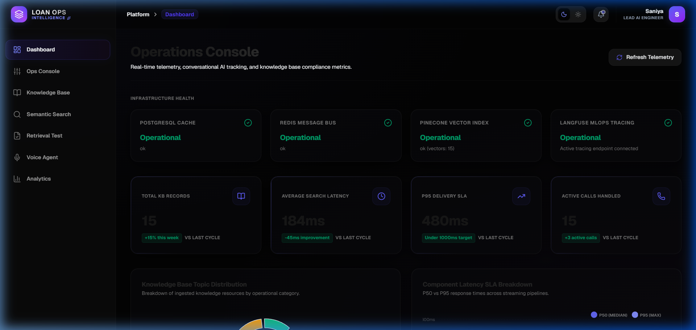 | 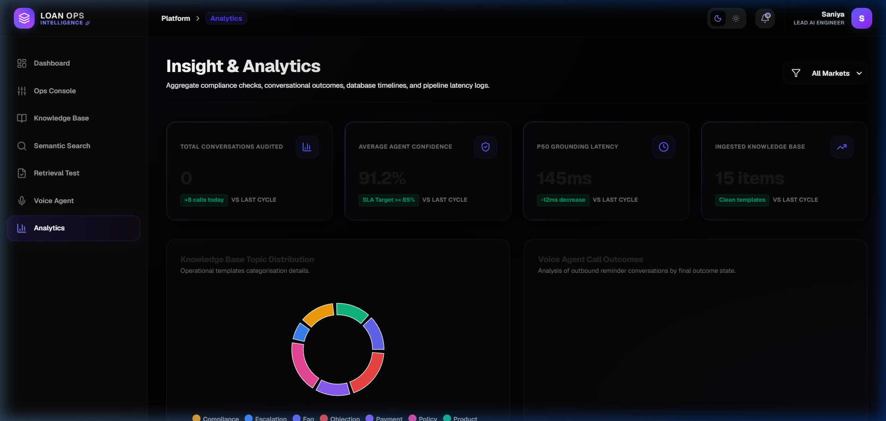 |
| Live call state, nudge feed, escalation alerts | Outcome breakdown, sentiment, latency trends |

| Voice Agent Console | Knowledge Search |
| :---: | :---: |
| 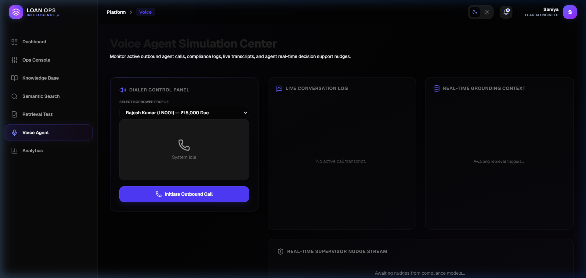 | 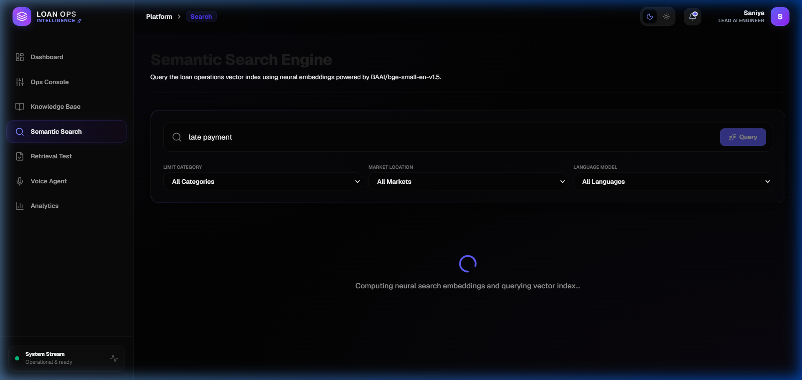 |
| Real-time transcript and tool-call trace | Semantic search with citations and relevance scores |

| Borrower Lookup | Live Call View |
| :---: | :---: |
| 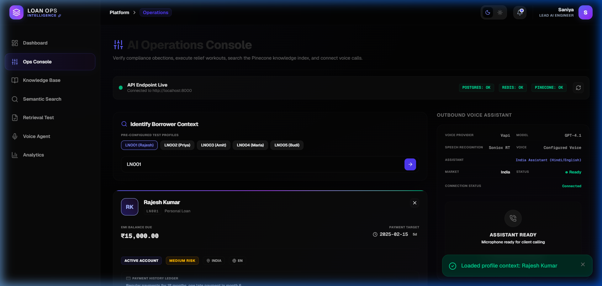 | 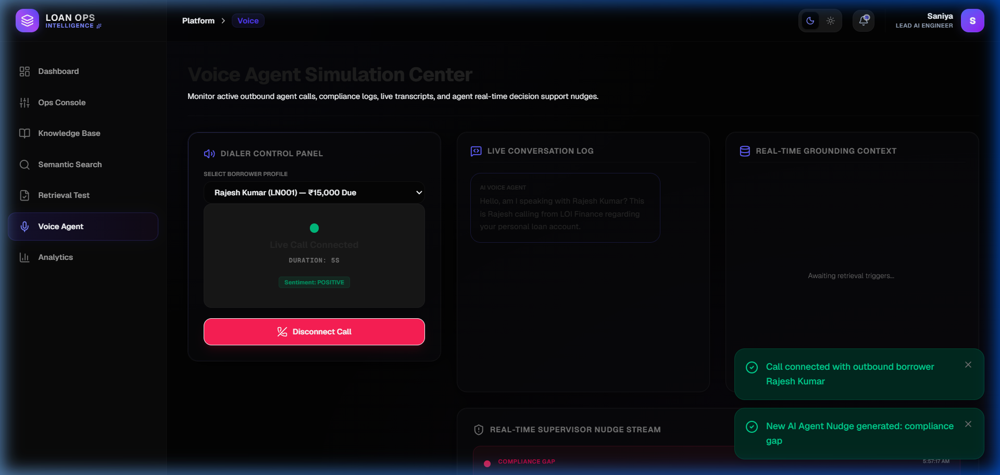 |
| Structured borrower/loan resolution | In-progress call with streaming nudge overlay |

| Evaluation Results | Settings |
| :---: | :---: |
| 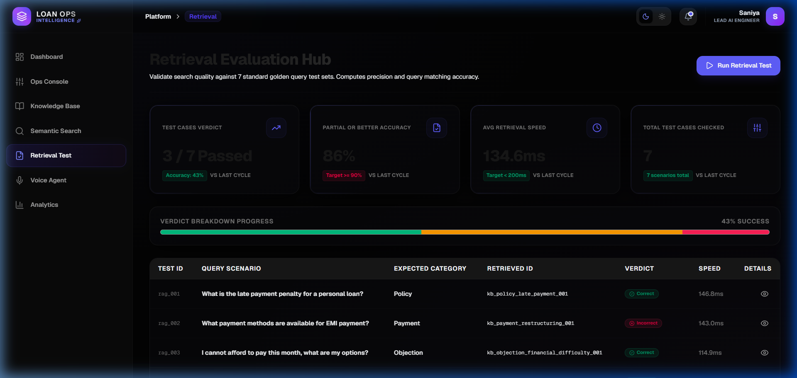 | 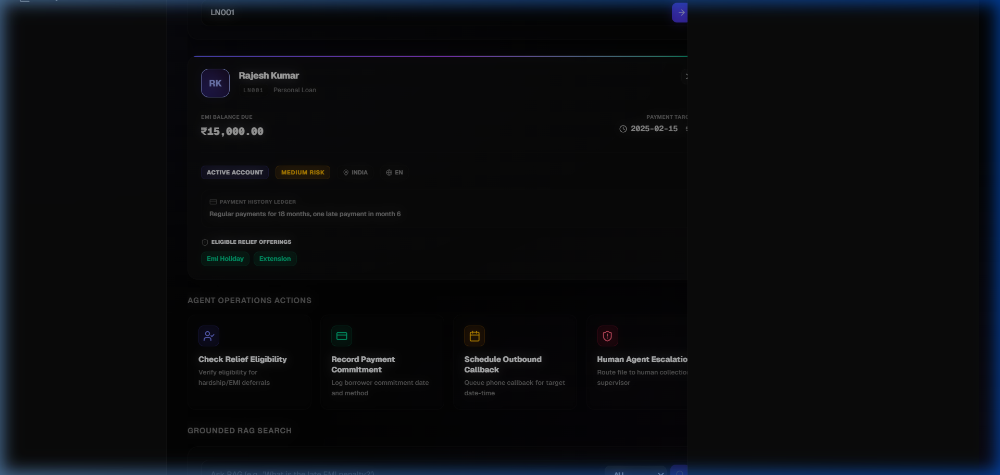 |
| Retrieval verdicts and nudge precision/recall | Business rules, market, and assistant configuration |

</div>

---

## 🎬 Demo

<div align="center">


*End-to-end walkthrough: outbound call → grounded knowledge retrieval → live nudge → dashboard update*

</div>

| Resource | Link |
| --- | --- |
| 🔴 Live Demo | [Add deployed URL here](#) |
| 🎥 Video Walkthrough | [Add video link here](#) |
| 📄 Architecture PDF | [Add architecture document here](#) |

<div align="center">

| Dashboard | Knowledge Search | Voice Agent |
| :---: | :---: | :---: |
|  |  |  |

</div>

---

## 🚀 Installation

### Prerequisites

- Python 3.12+
- Node.js 20+
- Docker Desktop (Compose v2)
- OpenAI, Pinecone, Deepgram, Vapi, and Langfuse API credentials

### 1. Clone and configure environment

```powershell
git clone https://github.com/<your-org>/loan-operation-intelligence.git
cd loan-operation-intelligence
Copy-Item .env.template .env
# Populate OpenAI, Pinecone, Deepgram, Vapi, and Langfuse credentials in .env
```

> ⚠️ Never commit `.env`, call recordings containing customer data, or real borrower information.

### 2. Start infrastructure and migrate

```powershell
docker compose up -d postgres redis
cd backend
alembic upgrade head
cd ..
```

### 3. Seed the knowledge base and business rules

```powershell
make db-seed
make ingest-kb
```

---

## 🔐 Environment Variables

Define these in `.env` (see `.env.template` for the full list):

```bash
# --- Application ---
APP_ENV=development
FRONTEND_URL=http://localhost:3000

# --- PostgreSQL ---
POSTGRES_HOST=localhost
POSTGRES_PORT=5432
POSTGRES_USER=loi_user
POSTGRES_PASSWORD=changeme
POSTGRES_DB=loan_operation_intelligence

# --- Redis ---
REDIS_HOST=localhost
REDIS_PORT=6379

# --- OpenAI ---
OPENAI_API_KEY=sk-...
OPENAI_EMBEDDING_MODEL=text-embedding-3-small
OPENAI_LLM_MODEL=gpt-4o
OPENAI_LLM_MODEL_MINI=gpt-4o-mini

# --- Pinecone ---
PINECONE_API_KEY=...
PINECONE_INDEX_NAME=loan-kb
PINECONE_ENVIRONMENT=us-east-1

# --- Vapi ---
VAPI_API_KEY=...
VAPI_ASSISTANT_ID_EN=...
VAPI_PHONE_NUMBER_ID=...
VAPI_WEBHOOK_SECRET=...

# --- Deepgram ---
DEEPGRAM_API_KEY=...

# --- Langfuse ---
LANGFUSE_PUBLIC_KEY=...
LANGFUSE_SECRET_KEY=...
LANGFUSE_HOST=https://cloud.langfuse.com

# --- PII ---
PII_DETECTION_ENABLED=true
PII_DETECTION_THRESHOLD=0.7
```

---

## 🐳 Running with Docker

```powershell
docker compose up -d postgres redis
cd backend
alembic upgrade head
uvicorn app.main:app --host 0.0.0.0 --port 8000
```

Production-oriented Compose configuration lives in `infra/`.

---

## 💻 Local Development

```powershell
# Backend
cd backend
pip install -r requirements.txt --break-system-packages
uvicorn app.main:app --reload --port 8000

# Frontend (second terminal)
cd frontend
npm install
npm run dev
```

- API: `http://localhost:8000`
- Interactive docs: `http://localhost:8000/docs`
- Dashboard: `http://localhost:3000`

---

## 📡 API Documentation

Full interactive documentation is served at `/docs` (Swagger UI) and `/redoc`. Major endpoints:

| Method | Endpoint | Description |
| --- | --- | --- |
| `GET` | `/api/health` | Liveness probe |
| `GET` | `/api/health/ready` | Readiness probe (PostgreSQL, Redis, Pinecone) |
| `POST` | `/api/voice/webhook` | Vapi webhook — function calls, status updates, end-of-call reports |
| `POST` | `/api/voice/outbound-call` | Trigger an outbound pre-due reminder call |
| `POST` | `/api/knowledge/ingest` | Bulk KB ingestion (PII detect → chunk → embed → store) |
| `POST` | `/api/knowledge/search` | RAG search with metadata filtering |
| `GET` | `/api/knowledge/retrieval-test` | Run the Q2 retrieval evaluation (5+ queries with verdicts) |
| `GET` | `/api/calls` | List calls with filtering and pagination |
| `GET` | `/api/calls/{call_id}/transcript` | Full conversation transcript |
| `GET` | `/api/calls/{call_id}/events` | Call event timeline (audit trail) |
| `GET` | `/api/nudges/stream/{call_id}` | Server-sent live nudge stream |
| `POST` | `/api/nudges/session/start` | Start a real-time nudge processing session |
| `GET` | `/api/nudges/latency-report` | Aggregate P50/P95 nudge pipeline latency |
| `POST` | `/api/eval/run` | Run retrieval, nudge quality, or voice-flow evaluations |

---

## 🎙️ Voice Agent Workflow

```text
Customer
   │
   ▼
Vapi (ASR / TTS / Turn-Taking)
   │
   ▼
FastAPI Webhook Handler
   │
   ▼
Business Tools (lookup_borrower · check_eligibility · schedule_callback · escalate_to_human)
   │
   ▼
Knowledge Base (RAG-grounded answer + citations)
   │
   ▼
Grounded, Cited Response back to Customer
```

Every borrower-facing fact — due date, amount, policy detail — is resolved through a tool call against PostgreSQL or the knowledge base, never asserted from model memory alone.

---

## 🔎 Retrieval Pipeline

```text
Document
   │
   ▼
Chunking (category-aware: FAQ/objection atomic, policy/product overlap-windowed)
   │
   ▼
Embeddings (OpenAI text-embedding-3-small)
   │
   ▼
Pinecone (metadata-filtered vector index)
   │
   ▼
Retriever (top-k similarity + metadata filter + rerank)
   │
   ▼
LLM (context-grounded reasoning)
   │
   ▼
Grounded Response (with record_id, source, and relevance score)
```

---

## 🌟 Features Showcase

| Feature | How it works |
| --- | --- |
| **Knowledge Search** | Semantic + metadata-filtered retrieval over PostgreSQL-backed, Pinecone-indexed KB records |
| **Borrower Lookup** | Voice tool call resolves borrower/loan identity against structured records |
| **Eligibility Checking** | Declarative rule engine evaluates hardship/restructuring program eligibility |
| **Voice Calls** | Vapi-orchestrated inbound/outbound calling with dynamic, market-aware assistant configuration |
| **Callback Scheduling** | In-call scheduling captured as a structured, queryable outcome |
| **Payment Commitments** | Commitment date/amount/method extracted and persisted per call |
| **Escalations** | Deterministic rule-based and LLM-detected escalation triggers, both logged with reason |
| **Analytics** | Call outcome, sentiment, and latency analytics exposed via `/api/calls/analytics` and `/api/eval` |
| **Compliance** | Automated disclosure checklist and prohibited-language detection scored per call |
| **Multilingual Support** | Philippines (English/Filipino/Taglish) and Indonesia (formal/colloquial Bahasa) localized flows |

---

## 💡 Project Highlights

- **Grounding over generation** — every policy or product statement the voice agent makes is retrieved with a citation, not recalled from the model's parameters. Financial facts (amount, due date) are resolved via tool calls against PostgreSQL, structurally separated from the knowledge base.
- **Deterministic rules alongside probabilistic reasoning** — the compliance monitor and rule engine evaluate independently of the LLM's own judgment, so escalation and disclosure requirements remain auditable even if the model's behavior drifts.
- **Sync/async split by latency budget** — the Conversation Tracker uses fast, deterministic signal extraction (no LLM round-trip) to stay responsive on a live call, while the Nudge Pipeline batches transcript segments before calling out to an LLM — the right tool for each latency budget, not a single approach applied everywhere.
- **One shared signal extraction layer** — a single `SignalExtractionService` feeds both the per-turn Conversation Tracker and the real-time Nudge Pipeline, avoiding duplicated intent/entity logic across two LangGraph workflows.
- **Event-sourced audit trail** — every state transition, tool call, and escalation is logged to `call_events`, enabling full conversation replay and compliance review.
- **Measured, not asserted, quality** — retrieval verdicts, nudge precision/recall, and pipeline latency are computed by the evaluation harness (`/api/eval/run`), not claimed anecdotally.

---

## 📊 Observability

Every RAG query, tool call, and nudge generation is traced through Langfuse as a structured span, not just logged as text.

| Signal | What's captured | Where |
| --- | --- | --- |
| **Tracing** | Full request tree per call: webhook → tool calls → RAG queries → LLM generation | `create_trace()` in `app/core/langfuse_client.py`, invoked from `voice_service.py`, `rag_service.py` |
| **Latency** | Per-component timing (ASR, retrieval, LLM, delivery) and end-to-end P50/P95 | `LatencyTracker` in `app/utils/latency.py`, reported via `/api/nudges/latency-report` |
| **Evaluations** | Retrieval accuracy (correct / partially correct / incorrect verdicts), nudge precision/recall/F1 | `POST /api/eval/run`, results persisted under `evaluation/results/` |
| **Tool Calls** | Every function call name, parameters, and result, logged to both Langfuse and `call_events` | `voice_service.handle_function_call()` |
| **LLM Tokens** | Prompt/completion token counts per generation, surfaced in the Langfuse trace UI | Native Langfuse instrumentation on `AsyncOpenAI` calls |
| **Retrieval Quality** | Relevance score, matched-keyword ratio, and verdict per test query | `RAGService.run_retrieval_test()` |
| **Failure Analysis** | False-positive/false-negative breakdown for nudges; missing-citation and low-confidence fallback rates | `_run_nudge_quality()` in `app/routes/evaluation.py` |

---

## 🏭 Production Considerations

| Area | Approach |
| --- | --- |
| **Monitoring** | `/api/health` and `/api/health/ready` readiness probes across PostgreSQL, Redis, and Pinecone |
| **Observability** | Langfuse tracing across RAG queries, tool calls, and nudge generation |
| **Scalability** | Stateless FastAPI workers; move in-process streaming to durable queues/workers at 10x volume |
| **Caching** | Redis-backed session state, idempotency, and KB query caching |
| **Vector Search** | Pinecone metadata filtering for category/product/language/market-scoped retrieval |
| **Database** | Async SQLAlchemy + Alembic migrations; isolated PostgreSQL test database |
| **Redis** | Pub/sub for nudge delivery, cooldown/dedup state, and rate limiting |
| **Streaming** | Deepgram streaming ASR with chunked, real-time-paced transcript processing |

At 10x call volume: replace in-process streaming with durable queues/workers, isolate call sessions, autoscale ASR/nudge consumers independently, enforce connection pooling and rate limits, and retain only redacted operational telemetry.

---

## 🔒 Security

- No credentials, recordings with PII, or customer data committed to the repository.
- PII detection and redaction (Microsoft Presidio) applied before knowledge-base indexing or evidence storage.
- Webhook signature verification for Vapi callbacks.
- Environment-variable-based secret management; `.env` excluded from version control.
- Prohibited-language and required-disclosure checks enforced independently of LLM output.

---

## 🔐 Security Architecture

| Control | Implementation |
| --- | --- |
| **Secret Management** | All credentials (OpenAI, Pinecone, Vapi, Deepgram, Langfuse, Postgres, Redis) loaded via `pydantic-settings` from environment variables; `.env` is git-ignored and never baked into images |
| **Webhook Verification** | Vapi webhook payloads validated against `VAPI_WEBHOOK_SECRET` before any function-call is executed, preventing spoofed tool invocations |
| **PII Redaction** | Presidio-based detection (`PERSON`, `PHONE_NUMBER`, `EMAIL_ADDRESS`, `CREDIT_CARD`, `LOCATION`) runs at ingestion; `kb_records.content_clean` stores the redacted form separately from raw `content` |
| **Role Separation** | Voice-agent tool calls execute through a fixed, named handler map (`voice_service.handle_function_call`) — no arbitrary code execution path from LLM output to the database |
| **Audit Logging** | `call_events` is append-only and event-sourced; every state transition, tool call, RAG query, and escalation is independently timestamped and immutable |
| **Grounded Responses** | The LLM's generation context is structurally limited to tool-call results and retrieved KB chunks — it has no path to assert unsourced financial facts |
| **Rate Limiting** | Redis-backed request throttling on ingestion and search endpoints; idempotency keys prevent duplicate business actions (callback creation, escalation webhooks) on webhook retry |

---

## 📈 Scalability

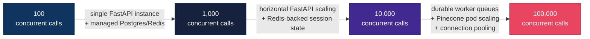
```mermaid
flowchart LR
    S1["100<br/>concurrent calls"] -->|"single FastAPI instance<br/>+ managed Postgres/Redis"| S2["1,000<br/>concurrent calls"]
    S2 -->|"horizontal FastAPI scaling<br/>+ Redis-backed session state"| S3["10,000<br/>concurrent calls"]
    S3 -->|"durable worker queues<br/>+ Pinecone pod scaling<br/>+ connection pooling"| S4["100,000<br/>concurrent calls"]

    style S1 fill:#0f3460,stroke:#16213e,color:#fff
    style S2 fill:#16213e,stroke:#0f3460,color:#fff
    style S3 fill:#412991,stroke:#2a1a5e,color:#fff
    style S4 fill:#e94560,stroke:#a12938,color:#fff
```

| Scale | Bottleneck | Mitigation |
| --- | --- | --- |
| **100 concurrent calls** | None — single FastAPI instance handles this comfortably | Baseline: managed PostgreSQL + Redis, in-process async I/O |
| **1,000 concurrent calls** | FastAPI CPU/connection limits on a single instance | Horizontal FastAPI scaling behind a load balancer; all state kept in Redis/PostgreSQL so instances remain stateless |
| **10,000 concurrent calls** | In-process streaming ASR/nudge processing saturates worker threads | Move `NudgeEngine` sessions to durable, independently-autoscaled worker processes (queue-backed, not in-request) |
| **100,000 concurrent calls** | Vector search latency under load; database connection exhaustion | Pinecone pod/replica scaling for read throughput; PgBouncer-style connection pooling; partition `call_events` by time |

**Core scaling principles applied throughout:**

- **Stateless services** — FastAPI instances hold no in-memory session state; everything durable lives in PostgreSQL, everything ephemeral lives in Redis, so any instance can serve any request.
- **Horizontal FastAPI scaling** — the async request/response cycle has no shared mutable state, so adding instances is a pure throughput multiplier.
- **Redis as the shared coordination layer** — cooldowns, dedup windows, and pub/sub fan-out work identically whether there's 1 or 50 API instances behind the load balancer.
- **Worker queues for streaming work** — ASR and signal-extraction pipelines are the components most likely to need independent scaling from the request/response API tier; the architecture already isolates them behind `NudgeEngine` sessions for this reason.
- **Vector DB scaling is decoupled** — Pinecone scales its own read/write capacity independently of the application tier, so retrieval throughput isn't bound by FastAPI instance count.
- **Database connection pooling** — `asyncpg` pooling (`pool_size=10, max_overflow=20`) is already configured per instance; production scaling adds a pooler (PgBouncer) in front of PostgreSQL itself as instance count grows.

---

## 🧪 Benchmarks

> Placeholder tables — to be populated from `evaluation/results/` after a full evaluation run (`POST /api/eval/run?eval_type=all`).

**Retrieval Accuracy**

| Metric | Value |
| --- | --- |
| Correct verdicts | TBD |
| Partially correct verdicts | TBD |
| Incorrect verdicts | TBD |
| Overall accuracy | TBD |
| Avg. retrieval time (ms) | TBD |

**Latency**

| Component | P50 (ms) | P95 (ms) |
| --- | --- | --- |
| ASR (Deepgram) | TBD | TBD |
| Signal extraction | TBD | TBD |
| LLM generation | TBD | TBD |
| Delivery (Redis → SSE) | TBD | TBD |
| **End-to-end** | **TBD** | **TBD** |

**Tool Calls**

| Tool | Avg. latency (ms) | Success rate |
| --- | --- | --- |
| `lookup_borrower` | TBD | TBD |
| `check_eligibility` | TBD | TBD |
| `schedule_callback` | TBD | TBD |
| `record_payment_commitment` | TBD | TBD |
| `escalate_to_human` | TBD | TBD |

**Nudge Precision**

| Metric | Value |
| --- | --- |
| Precision | TBD |
| Recall | TBD |
| F1 score | TBD |
| False-positive rate | TBD |

**Voice Response Time**

| Percentile | Time (ms) |
| --- | --- |
| P50 | TBD |
| P95 | TBD |
| P99 | TBD |

---

## 🗺️ Future Improvements

- LLM-as-judge reranking for retrieval quality (currently cosine-similarity ranked)
- Native-speaker and compliance validation for Philippines/Indonesia scripts before production use
- Durable queue-based architecture for the nudge pipeline at scale
- Expanded eligibility rule coverage and A/B-testable rule versions
- Outbound call orchestration via the Vapi phone API (currently stubbed)

---

## 🤝 Contributing

This repository was built as an AI Engineer assessment submission. Issues and pull requests demonstrating alternative approaches, additional test coverage, or design critique are welcome for discussion.

1. Fork the repository
2. Create a feature branch (`git checkout -b feature/your-feature`)
3. Commit your changes with clear messages
4. Open a pull request describing the change and rationale

---

## 📄 License

Assessment submission. Not licensed for production deployment without security, legal, and market-compliance review.

---

## 🙏 Acknowledgements

Built with [FastAPI](https://fastapi.tiangolo.com/), [Next.js](https://nextjs.org/), [LangGraph](https://www.langchain.com/langgraph), [Pinecone](https://www.pinecone.io/), [OpenAI](https://openai.com/), [Vapi](https://vapi.ai/), [Deepgram](https://deepgram.com/), and [Langfuse](https://langfuse.com/).

<div align="center">

**[⬆ Back to top](#-loan-operation-intelligence)**

</div>